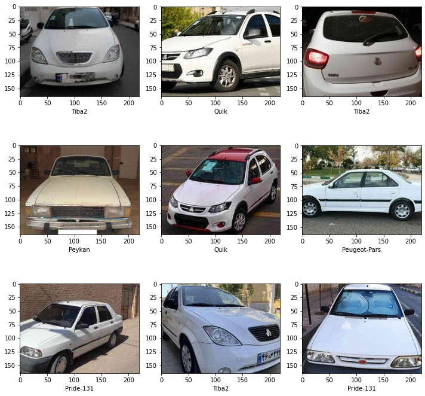

Pass this code a picture of an Iranian vehicle and it will tell you what car it is, known vehicle models are as follows: <br />
```
Mazda-2000
Nissan-Zamiad
Peugeot-206
Peugeot-207i
Peugeot-405
Peugeot-Pars
Peykan
Pride-111
Pride-131
Quik
Renault-L90
Samand
Tiba2
```


 <br />
This is the trained model of usefashrfi dataset:  <br />

[usefashrfi](https://www.kaggle.com/datasets/usefashrfi/iran-used-cars-dataset "usefashrfi")
